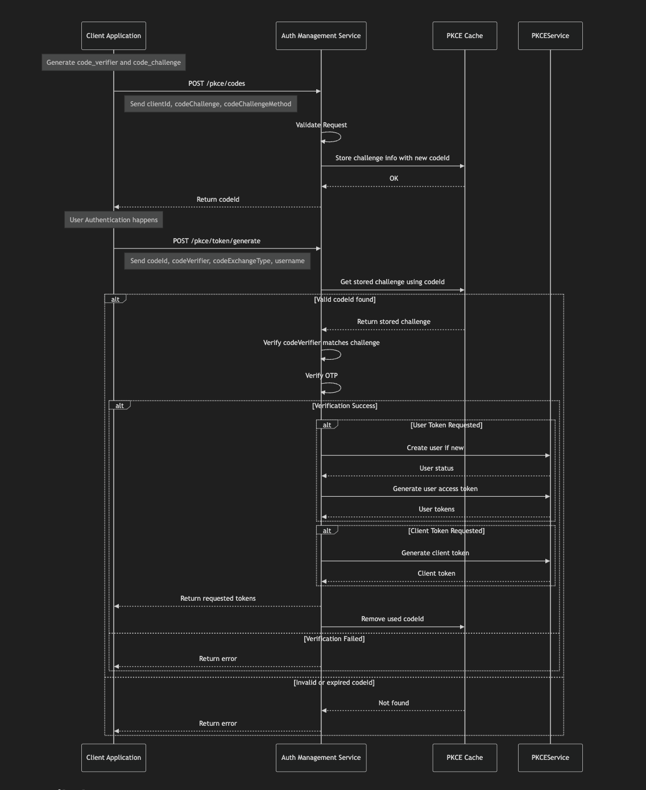
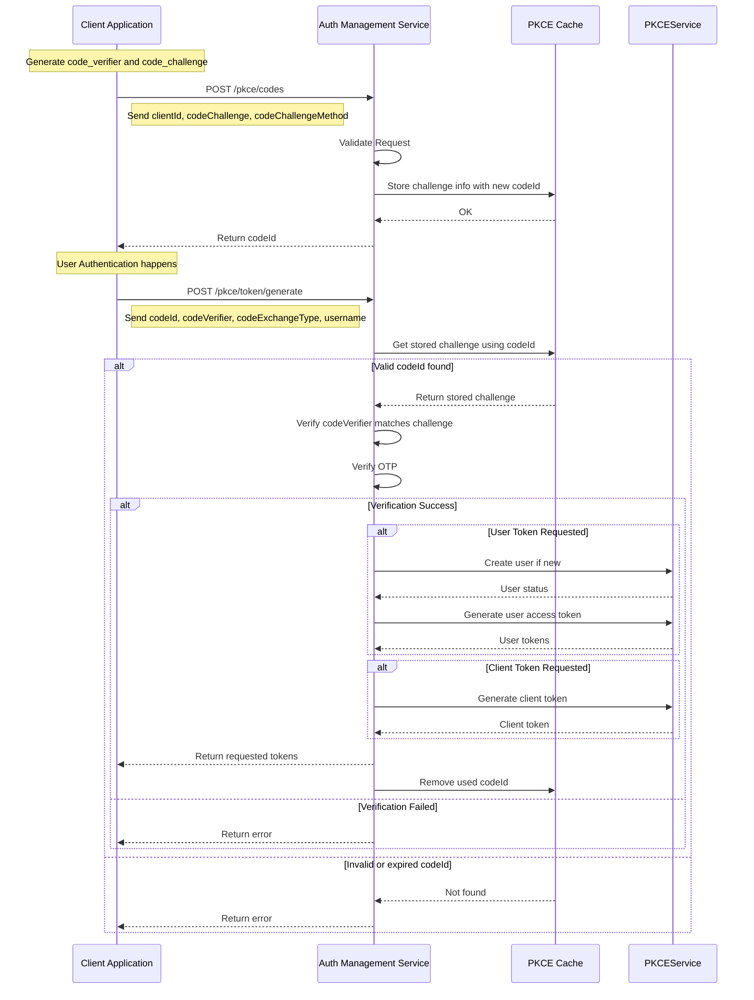

# Technical Documentation: Understanding the Auth Management Service PKCE Flow

## 1. Introduction: What Problem Are We Solving?

Securely granting applications access to user data or other services without sharing primary credentials (like passwords) is crucial. For applications that cannot keep a secret securely (like web apps running in a browser or mobile apps, known as "public clients"), the standard **OAuth 2.0 Authorization Code flow** needs protection against attackers stealing the temporary authorization code.

**PKCE (Proof Key for Code Exchange)** provides this protection by adding a cryptographic challenge. This ensures that only the application that *starts* the authorization process can actually *complete* it and receive the valuable access tokens.

**How Our Service Implements PKCE:**

This **Auth Management Service** implements a **custom, API-based PKCE flow**. It acts as a secure broker or facade that manages the PKCE challenge exchange and interacts with our underlying identity provider (Keycloak) to issue tokens. This is different from the typical browser-redirect OAuth flow.

This document explains how this custom flow works, involving:

*   **Client Application:** The application (e.g., SPA, mobile app, backend service) that needs tokens.
*   **Auth Management Service:** This service. It manages the PKCE state, validates the client's proof key, and orchestrates token generation with the identity provider.
*   **Keycloak (underlying Identity Provider):** The system actually managing user identities and client registrations, used by the Auth Management Service behind the scenes.

## 2. Why PKCE? The "Proof Key" Analogy (Still Applies!)

Even in our custom flow, the core PKCE principle remains the same: proving possession of a secret.

1.  **Client App:** Creates a secret key (`code_verifier`) and a corresponding padlock (`code_challenge`). Keeps the key secret.
2.  **Registering the Challenge:** Sends the *padlock* (`code_challenge`) to the **Auth Management Service**'s `/pkce/codes` endpoint. The service gives back a receipt (`codeId`) and remembers the padlock associated with this receipt.
3.  **Token Request:** Sends the receipt (`codeId`) *and* the secret key (`code_verifier`) to the **Auth Management Service**'s `/pkce/token/generate` endpoint (along with other details like username if requesting user tokens).
4.  **Auth Management Service Verification:** Uses the key (`code_verifier`) to try and open the padlock (`code_challenge`) it stored earlier (identified by the `codeId`).
    *   **Success:** If the key opens the padlock, the service knows the client is legitimate. It then proceeds to interact with Keycloak to potentially create the user (if new) and generate the requested tokens (client and/or user tokens).
    *   **Failure:** If the key doesn't open the padlock, the service rejects the request.

This ensures only the client possessing the original secret `code_verifier` can obtain tokens via the `/pkce/token/generate` endpoint.

## 3. The Players (Actors)

*   **Client Application:**
    *   Generates `code_verifier` and `code_challenge`.
    *   Calls Auth Management Service `/pkce/codes` endpoint to register the challenge and get a `codeId`.
    *   Authenticates the user through some mechanism (details depend on the client type - may involve passing user credentials in the token request).
    *   Calls Auth Management Service `/pkce/token/generate` endpoint with `codeId`, `codeVerifier`, desired `codeExchangeType` (client/user tokens), and potentially user credentials.
    *   Receives tokens (`access_token`, `refresh_token`) from the Auth Management Service.
    *   Uses the `access_token` to call other protected APIs (which might be hosted by this service or others).
*   **Auth Management Service:**
    *   Exposes `/pkce/codes` endpoint: Receives and validates client details and the `code_challenge`, stores them in a cache mapped to a generated `codeId`, returns `codeId`.
    *   Exposes `/pkce/token/generate` endpoint:
        *   Receives `codeId`, `codeVerifier`, `codeExchangeType` parameters, and potentially user details.
        *   Retrieves the stored challenge using `codeId`.
        *   **Performs the PKCE verification** (checks if `codeVerifier` matches stored `codeChallenge`).
        *   Interacts with `PKCEService` (which uses Keycloak):
            *   Registers the user if needed (`pkceService.createUser`).
            *   Generates client tokens if requested.
            *   Generates user tokens if requested (`pkceService.generateUserAccessToken`).
        *   Returns the generated tokens to the Client Application.
        *   Evicts the used `codeId` entry from the cache.
    *   Exposes `/pkce/refresh-user-token` for refreshing tokens.
    *   Also acts as a **Resource Server** for validating tokens presented to its *other* APIs (using `SecurityConfig`).
*   **Keycloak (Identity Provider):**
    *   Managed by the Auth Management Service via `PKCEService` and `PlatformSwitchService`.
    *   Stores user identities and client application registrations/secrets.
    *   Handles user creation requests from the Auth Management Service.
    *   Handles token generation requests (e.g., password grant, client credentials grant, refresh token grant) initiated by the Auth Management Service on behalf of the client.
    *   **Does NOT directly interact with the Client Application** in this specific custom PKCE flow (no user redirects to Keycloak's `/auth` endpoint are involved here).

## 4. The Custom API-Based PKCE Flow: Step-by-Step

**Detailed Steps:**

1.  **Client Prepares:** The Client App creates the `code_verifier` and `code_challenge`.
2.  **Register Challenge:** The Client App makes a POST request to the Auth Management Service's `/v1/{realm}/pkce/codes` endpoint, sending its `clientId`, the generated `codeChallenge`, and the `codeChallengeMethod`.
3.  **Service Stores Challenge:** The Auth Management Service validates the request, stores the challenge details securely in its cache associated with a unique, newly generated `codeId`. It returns this `codeId` to the Client App.
4.  **Client Authentication (Implicit/External):** The client needs to obtain user credentials if user tokens are required. This might involve the user entering a username/password directly into the client app. *(This step is external to the main API calls shown)*.
5.  **Token Request:** The Client App makes a POST request to the Auth Management Service's `/v1/{realm}/pkce/token/generate` endpoint. It sends the `codeId` received in step 3, the secret `codeVerifier` from step 1, parameters indicating the type of token requested (`codeExchangeType` - client/user), and user credentials (`username`, etc.) if requesting user tokens.
6.  **Service Retrieves & Verifies PKCE:** The Auth Management Service receives the request.
    *   It retrieves the previously stored challenge details from its cache using the `codeId`.
    *   It performs the core **PKCE check**: It transforms the incoming `codeVerifier` using the stored method and compares it to the stored `codeChallenge`. If it doesn't match, or if the `codeId` is invalid/expired, it returns an error.
7.  **Service Orchestrates Token Generation (on PKCE Success):**
    *   If PKCE validation passes, the service determines which tokens are needed based on the `codeExchangeType` parameters.
    *   It interacts with the `PKCEService` (which talks to Keycloak):
        *   If user tokens are requested: It may first ensure the user exists (creating them via `PKCEService` if necessary), then requests user tokens from `PKCEService` (likely using an appropriate grant type like Password Grant or another internal mechanism, leveraging the client's registered secrets and the provided user details).
        *   If client tokens are requested: It requests client tokens from `PKCEService` (likely using the Client Credentials grant).
8.  **Return Tokens:** The Auth Management Service bundles the generated tokens (access, refresh) into the response and sends it back to the Client App.
9.  **Cache Cleanup:** The service removes the used `codeId` entry from its cache to prevent reuse.
10. **Client Uses Token:** The Client App uses the received `access_token` to call protected APIs (hosted by this service or others), adding it to the `Authorization: Bearer <token>` header. These *other* APIs will validate the token using standard Resource Server mechanisms (as configured in `SecurityConfig`).

## 5. Summary of Service Roles

*   **Auth Management Service:** Acts as a **PKCE-enabled Token Endpoint facade**. It manages the PKCE state via its cache, performs the cryptographic PKCE verification, and orchestrates token generation (including user creation) by interacting with Keycloak via internal services (`PKCEService`). It *also* acts as a standard **Resource Server** for its other non-PKCE APIs.
*   **Keycloak:** The underlying **Identity Provider**, managed by the Auth Management Service. It stores identities and secrets and performs the actual token minting based on requests from the Auth Management Service. It is *not directly* involved in the PKCE challenge/verifier exchange with the client in *this specific flow*.

This custom flow centralizes the PKCE logic within the Auth Management Service's API, providing a specific interface for clients to obtain tokens using PKCE protection without engaging in the standard browser-based redirect flow. 